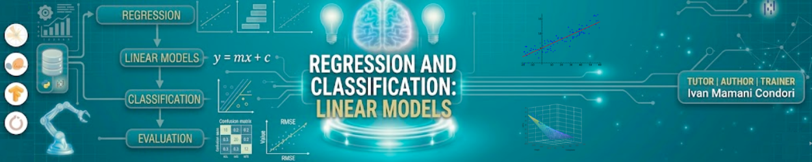

# Week 2 — Regression Models

Nesta semana introduzimos **modelos de regressão**, uma das técnicas mais importantes em **Machine Learning supervisionado**. Esses modelos permitem entender relações entre variáveis e realizar previsões a partir de dados.

Exploramos dois tipos principais de regressão:

- **Regressão Linear** para prever valores numéricos contínuos
- **Regressão Logística** para problemas de classificação binária

## Objetivo

Compreender os fundamentos dos **modelos de regressão** e aplicar técnicas de **regressão linear e regressão logística** para realizar previsões e avaliar o desempenho de modelos de Machine Learning.

## Conteúdos

- Introdução a **Modelos de Regressão**
- **Regressão Linear**
- Relação entre variáveis e previsão de valores contínuos
- **Regressão Logística**
- Probabilidade e função sigmoide
- Avaliação de modelos de classificação:
  - Matriz de confusão
  - Accuracy
  - Precision e Recall
  - Curva ROC
  - AUC (Area Under the Curve)

## Notebooks

Durante a semana implementamos modelos de regressão em dois exemplos práticos:

1. **Regression Models — California Housing**  
   Aplicação de **regressão linear e polinomial** para prever o valor médio das casas na Califórnia utilizando variáveis socioeconômicas.

   

2. **Logistic Regression Model — Breast Cancer Coimbra**  
   Aplicação de **regressão logística** para prever a probabilidade de presença de câncer de mama com base em variáveis clínicas.

   

## Material da aula

Slides:  

## Autor

Eng. Ivan Mamani

Responsável pelo desenvolvimento do conteúdo, material didático e notebooks desta semana.
