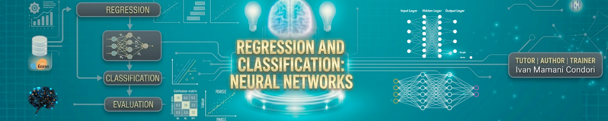

# Week 3 — Neural Networks

Nesta semana introduzimos **Redes Neurais**, uma das abordagens mais poderosas em **Machine Learning e Deep Learning**. Esses modelos são capazes de aprender padrões complexos nos dados e realizar tarefas de classificação com alta performance.

Exploramos os conceitos fundamentais que permitem às redes neurais aprender a partir de dados e melhorar suas previsões de forma iterativa.

## Objetivo

Compreender os fundamentos das **Redes Neurais** e implementar modelos de classificação utilizando arquiteturas multicamadas para resolver problemas reais, avaliando seu desempenho e comparando com modelos tradicionais.

## Conteúdos

- Introdução a **Redes Neurais**
- Neurônio artificial (Perceptron)
- Estrutura de uma rede neural:
  - Camada de entrada
  - Camadas ocultas
  - Camada de saída
- Pesos e bias
- Funções de ativação:
  - ReLU
  - Sigmoid
- Processo de treinamento:
  - Forward propagation
  - Função de perda (Loss)
  - Backpropagation
  - Otimizadores (Adam)
- Preparação de dados:
  - Normalização
  - Divisão treino/teste
- Avaliação de modelos:
  - Accuracy
  - Precision
  - Recall
  - F1-score

## Notebooks

Durante a semana implementamos redes neurais em um problema real de classificação:

1. **Neural Networks — Breast Cancer Coimbra**  
   Implementação de uma **rede neural multicamada com PyTorch** para prever a presença de câncer de mama com base em variáveis clínicas.  
   
   Comparação do desempenho com **Regressão Logística**.

   

## Material da aula

Slides:  

## Autor

Eng. Ivan Mamani

Responsável pelo desenvolvimento do conteúdo, material didático e notebooks desta semana.
