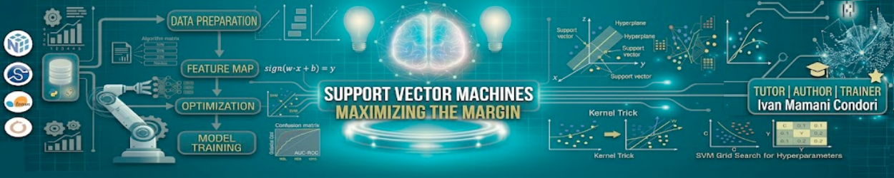

# Week 5 — Support Vector Machines (SVM)

Nesta semana aprofundamos o uso de **modelos de classificação supervisionada**, com foco em **Support Vector Machines (SVM)**, uma técnica poderosa para separação de dados em diferentes classes.

O objetivo é compreender como o SVM encontra o **hiperplano ótimo** que maximiza a margem entre as classes, além de explorar diferentes configurações e avaliar o impacto no desempenho do modelo.

## Objetivo

Compreender o funcionamento dos **Support Vector Machines**, desde a intuição geométrica até sua aplicação prática, e avaliar como diferentes configurações influenciam na performance do modelo.

## Conteúdos

- O que é um **Support Vector Machine (SVM)**
- Conceito de **margem máxima**
- Vetores de suporte (Support Vectors)
- **SVM Linear**
- **SVM com Kernel (RBF)**
- Intuição sobre transformação de espaço (kernel trick)
- Comparação com **Logistic Regression**
- **Hyperparameter Tuning**:
  - Parâmetro C
  - Gamma (RBF)
- Overfitting vs Underfitting
- Métricas de avaliação:
  - Accuracy
  - Precision
  - Recall
  - F1-score
- Importância da normalização dos dados

## Notebooks

Durante a semana desenvolvemos um experimento prático completo:

1. **SVM — Breast Cancer Coimbra Dataset**

   Pipeline implementado:

   - **EDA (Exploratory Data Analysis)**
   - Análise de distribuição das variáveis
   - Pré-processamento e normalização
   - Divisão treino/teste
   - Treinamento de modelos:
     - Logistic Regression
     - SVM Linear
     - SVM com Kernel RBF
   - Ajuste de hiperparâmetros
   - Avaliação e comparação de modelos

   Objetivo:
   > Comparar diferentes modelos de classificação e entender como o SVM se comporta em relação a outras abordagens.

   

## Material da aula

Slides:  

## Autor

Eng. Ivan Mamani  

Responsável pelo desenvolvimento do conteúdo, material didático e notebooks desta semana.
